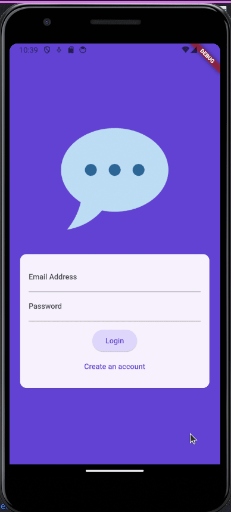
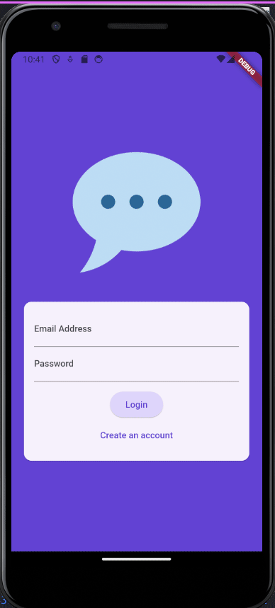
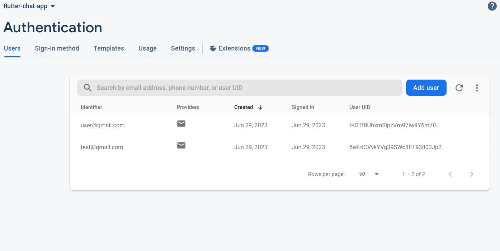
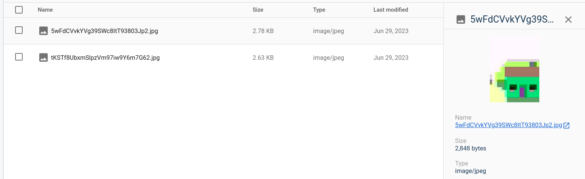
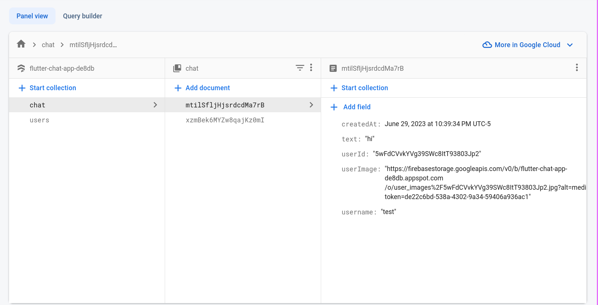

# Tutorial Chat Application for Learning Flutter & Dart

## Description
In this tutorial, I created a front-end that allows the user to submit their email, username, password, and picture. This information is stored/retrieved via Firebase. After submitting their information, they will be transfered to the chat screen. Here, the user will have their username and profile picture that they have signed up with. While in the chat, the user can send a message. They can also logout which will send them back to the login/signup page. Different users will have seperate popups.

## Requirements for running the code
- Flutter SDK: '>3.0.5<4.0.0'
- Your own Firebase setup
- Packages: firebase_core, firebase_auth, firebase_storage, image_picker, cloud_firestore, firebase_messaging

## Demonstration
#### Logging in

  

 

#### Storing user information

## Credits
The tutorial used was created by Maximilian Schwarzmuller.
- Title of course: Flutter & Dart - The Complete Guide [2023 Edition]
- Source: https://www.udemy.com/course/learn-flutter-dart-to-build-ios-android-apps/

